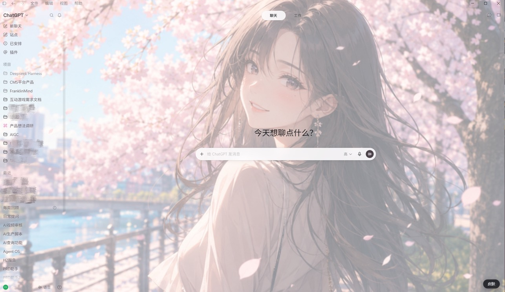
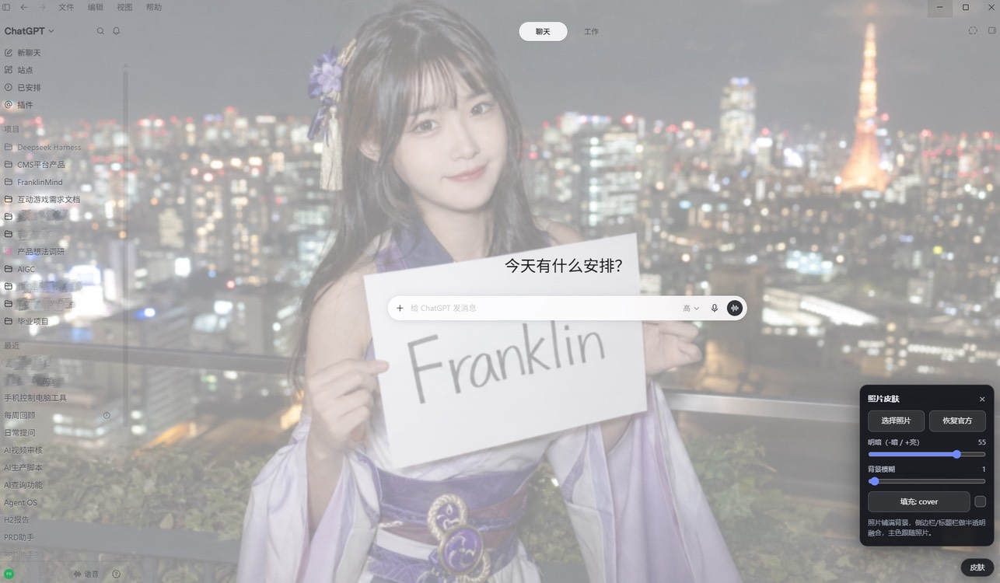

# ChatGPT_Skin (Codex)

适配于ChatGPT And Codex换色插件

🙎‍♂️支持Windows & macOS

实现方式：通过本地回环 Chrome DevTools Protocol（CDP）把一段皮肤脚本注入 ChatGPT 的 renderer，**不修改** ChatGPT 的 `app.asar` / WindowsApps 官方文件，可一键恢复官方外观。

> 取色算法移植自 `dsh-photo-skins` 的 `src/client/accent.ts`；本目录为独立工程，不依赖、不修改 dsh-photo-skins。


## 前置条件

- Windows 或 macOS + OpenAI ChatGPT 桌面版（已安装）
- 本地照片（PNG / JPG / WebP / GIF）
- 仅「bat / 命令行」方式需要 Node.js ≥ 22（使用原生 `fetch` / `WebSocket`，运行时零依赖）；「exe / 可执行文件」方式无需 Node（目前仅支持Windows系统）

## 🚀安装与启动 (必看!) 

### 方式一：双击可执行文件（零门槛，仅 Windows）

从 Release 下载 `CodexSkin.exe` 双击运行：自动带调试端口重启 ChatGPT、注入皮肤、恢复上次照片。无需安装 Node、无需命令行

> 首次运行 Windows 可能弹 SmartScreen（exe 未签名），点「更多信息 → 仍要运行」
> macOS 暂不支持文件启动，请用方式二的双击脚本。

### 方式二：双击脚本（需先装 Node）

1. 安装 Node.js ≥ 22：https://nodejs.org/
2. 双击对应平台的脚本：
   - Windows：`启动皮肤.bat`
   - macOS：`启动皮肤.command`
>Mac版本须知：首次需要在安全性与隐私中允许执行脚本

>或者Git 下载后首次需先 `chmod +x 启动皮肤.command`，再右键 → 打开
### 方式三：命令行（开发者）


> 打包可执行文件的方法：在 Windows 上运行 `npm run build:exe`（内部用 esbuild 打成 CJS 再走 Node SEA + postject），产物为 `dist/CodexSkin.exe`。SEA 不可跨平台交叉编译；macOS 因 Node SEA 在 Intel 芯片上会段错误，暂不打包，改用双击脚本 `启动皮肤.command`。

## 用法

### 应用内面板（推荐）

```powershell
node injector\inject.mjs
```

首次会关闭并带 `--remote-debugging-port` 重启 ChatGPT（打断当前会话，加 `--yes` 跳过确认），注入皮肤运行时。之后 **ChatGPT 右下角出现「皮肤」按钮**，点开面板即可在应用内：

- 选择照片（文件选择器）
- 拉「明暗」滑块（-100 压暗 ~ +100 提亮，0=原图）
- 拉「背景模糊」滑块（0-50 px，模糊照片）
- 切换填充方式 cover / contain
- 一键恢复官方外观（恢复后「皮肤」按钮保留，可再次换肤）

配置（照片压缩后 + 明暗 + 模糊 + 填充方式）会存到 ChatGPT 的 localStorage，启动自动恢复上次记录


### 命令行带初始照片

```powershell
node injector\inject.mjs --image "D:\path\to\photo.jpg"
```

直接带初始照片注入（同样会创建右下角面板）

> 重要：CDP 注入只在「带调试端口启动的 ChatGPT 进程」里生效，脚本不会写进 ChatGPT 安装目录

### 重启 / 重新开机后如何恢复

ChatGPT 冷启动后调试端口会丢失、皮肤消失。恢复只需一步：

```powershell
node injector\inject.mjs --yes
```

它会自动：检测端口 → 带 `--remote-debugging-port` 重启 ChatGPT → 重新注入 → **从 localStorage 自动恢复上次保存的照片和明暗/模糊/填充参数**。之后皮肤与面板一直存在，直到再次关闭 ChatGPT（正常使用中不要手动刷新页面）

常用参数：

| 参数 | 默认 | 说明 |
| --- | --- | --- |
| `--image <path>` | 无 | 照片路径（可选，注入后立即应用） |
| `--dim <n>` | 55 | 明暗：-100(最暗) ~ +100(最亮)，0=原图 |
| `--blur <n>` | 2 | 背景模糊 px（0-50） |
| `--fit cover\|contain` | cover | 壁纸填充方式 |
| `--port <n>` | 9222 | CDP 调试端口 |
| `--restore` | - | 一键还原官方外观 |
| `--probe` | - | dump ChatGPT DOM 摘要（调试/逆向用） |
| `--yes` | - | 重启 ChatGPT 前不确认 |

## 目录结构

```
Codex_Skin/
  injector/
    inject.mjs           # 入口：发现/启动 ChatGPT、连 CDP、注入、恢复、探测
    cdp.mjs              # 最小 CDP 客户端（Node 原生 WebSocket，零依赖）
  skin/
    accent.js            # 取色算法（移植自 dsh-photo-skins/accent.ts，UMD）
    apply-skin.js        # 注入到页面的皮肤脚本（照片图层/取色 + 面板 UI）
  启动皮肤.bat           # 双击启动（Windows；检测 Node 后运行注入器）
  启动皮肤.command       # 双击启动（macOS；检测 Node 后运行注入器）
  build-exe.mjs          # 打包脚本（esbuild CJS + Node SEA + postject -> CodexSkin.exe）
  sea-config.json        # SEA 打包配置（内置 accent.js / apply-skin.js 资源）
  LICENSE                # MIT License
  THIRD_PARTY_NOTICES.md # 第三方来源声明（accent.js 按 BSD-3-Clause 使用）
  package.json           # 元信息（license / engines / scripts），运行时零依赖
  .gitignore
  test-photo.png         # 测试用渐变照片
```

## 恢复

```powershell
node injector\inject.mjs --restore
```

删除注入的 `<style>` 与页面脚本，还原官方外观（官方文件未被改动）。


## 免责声明

- 本工具仅用于个人学习与研究，非 OpenAI 官方产品，与 OpenAI 无关。
- 通过本地 CDP 注入只改变本机 ChatGPT 进程的外观，不修改官方安装文件、不收集或上传任何数据。
- 请自行确认使用行为符合 OpenAI / ChatGPT 的服务条款与适用法律法规；因使用本工具产生的任何后果由使用者自行承担。

## 许可证

- 本项目：MIT License（见 `LICENSE`）。
- 第三方：`skin/accent.js` 取色算法移植自 dsh-photo-skins，按 BSD 3-Clause 使用；详见 `THIRD_PARTY_NOTICES.md`。
